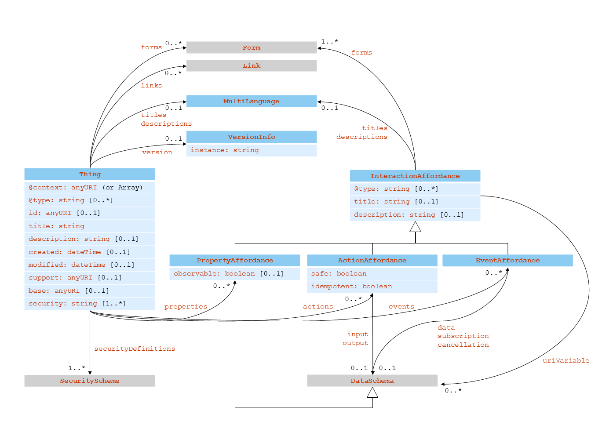

# Modello ontologico

## Che cos'è una Thing

Come già in parte anticipato nel capitolo precedente, una _thing_ ha per noi due aspetti costituenti: il suo comportamento e le sue "Interaction Affordances".
L'aspetto comportamentale comprende sia quello proprio della _thing_, sia quello legato alla corretta gestione delle "Interaction Affordances".
Queste rappresentano un modello di come un altro componente del sistema, uno che utilizza la _thing_, può interagire con quest'ultima attraverso dei metodi astratti, senza riferimenti a specifici protocolli di comunicazione o di codifica dei dati.
Per poter associare le "Interaction Affordances" a uno specifico protocollo di comunicazione supportato da questo progetto esistono i cosiddetti "Protocol Bindings", che non sono però di nostro interesse, così come non lo è la sua configurazione di sicurezza.
Questa rappresenta invece i meccanismi usati per controllare l'accesso alle "Interaction Affordances" e per gestire i metadati di sicurezza pubblici e privati associati.

Una _thing_ è però anche una risorsa _web_, nello stesso modo in cui lo è la una pagina di un sito _web_.
In quanto tale, essa possiede anche tutte le interazioni di cui una risorsa è capace, ovvero quelle di navigazione, che permettono di raggiungerla tramite _link_ e da questa poi passare ad altre ad essa collegate sempre attraverso _link_.
Più in generale, esistono sul _web_ i cosiddetti "_hypermedia control_", ovvero dei comandi che sono parte della risorsa stessa a cui un _client_ sta accedendo e che vengono perciò dinamicamente generati da chi la fornisce e scoperti da chi la ottiene.
In questo modo chi fornisce la risorsa può tenere conto dello stato dell'applicazione di cui questa fa parte per capire quali di essi includere.
Un "_hypermedia control_" descrive come effettuare l'interazione stessa e può essere o un _link_, come già detto, ma anche un _web form_, un comando che rende possibile qualsiasi tipo di operazione. [@wot-architecture]

La definizione dei _link_ e dei _form_ fa parte di un'ontologia parallela a quella di nostro interesse, perciò non entreremo nel dettaglio della loro descrizione.
Ci basta essere a conoscenza della loro esistenza, così come della configurazione di sicurezza di una _thing_, dato che saranno menzionati nell'ontologia che è invece lo scopo di questa relazione.

## Thing e interazioni

Tralasciando l'aspetto comportamentale, che è maggiormente legato alla sua implementazione e non alla sua definizione, è evidente che la componente più importante di una _thing_ è quella delle interazioni che è capace di avere.
Per questo motivo all'interno del progetto WoT è stato definito un "Interaction Model", capace di dare una definizione univoca all'astrazione di interazione utilizzata.
In questo modo, un'interazione può essere sia sufficientemente generale tale da poter essere utilizzata come modello per le sue concrete implementazioni associate alle varie _thing_, sia sufficientemente specifica tale da poter dare specifiche linee guida per la sua implementazione.

L'elemento fondante del modello di interazione che una _thing_ può avere con un altro componente sono le "Interaction Affordance", che possono essere di tre tipologie: "Proprietà", "Azioni" ed "Eventi".

Una "Proprietà" modella un'operazione capace di esporre lo stato di una _thing_, che dovrà perciò necessariamente poter essere letto, ma secondo WoT potrà anche essere modificato. Una proprietà può anche essere resa osservabile nel momento nel quale la _thing_ che la espone decide di effettuare l'operazione di "_push_" del suo stato ad ogni suo cambiamento a tutti coloro che si sono registrati per l'osservazione.
Possono essere modellati attraverso proprietà, ad esempio, un valore di un sensore o il risultato di una computazione, che possono essere unicamente letti, ma anche il valore di un attuatore dotato di uno stato interno o i parametri di una configurazione, che possono essere letti, ma anche scritti.

Un'"Azione" modella un'operazione che permette di invocare una funzione della _thing_. Il risultato può essere la manipolazione dello stato interno, non direttamente esposto, della _thing_, oppure la manipolazione dello stato esposto dalla _thing_, quindi una o più proprietà alla volta, seguendo una logica interna alla _thing_ stessa.
Un'azione può coinvolgere l'avvio di un processo per la modifica dello stato variamente complesso, che può durare nel tempo e che può avere anche dei risultati fisici.
Possono essere modellati come azioni, ad esempio, la riduzione della luminosità di una lampadina, che deve avvenire lungo un certo arco temporale, l'esecuzione di un flusso di controllo proprio della _thing_, che non deve essere pubblicamente esposto, oppure la stampa di un documento, che è un processo dalla durata non istantanea.

Un "Evento" modella una sorgente di eventi che effettua l'operazione di "_push_" dei dati in maniera asincrona dalla _thing_ alla componente che la usa.
I dati che vengono comunicati non sono perciò lo stato della _thing_, che abbiamo detto poter essere recuperato attraverso le sue proprietà, ma le transizioni di stato.
Un evento potrebbe verificarsi a seguito di condizioni che non sono direttamente manipolabili come proprietà.
Possono essere modellati come eventi, ad esempio, un allarme o il campionamento di una serie temporale di cui viene fatto il _push_ ad intervalli regolari.

Qualora il formato dei dati non possa essere interamente dedotto dal "Protocol Binding", è possibile per una qualsiasi "Interaction Affordance" contenere uno schema per i dati che descriva com'è strutturato lo stato esposto, per le proprietà, gli input e gli output, per le azioni, e i dati trasmessi e i messaggi di controllo della sottoscrizione, per gli eventi. [@wot-architecture]

## Modello di una "Thing Description"

Una "Thing Description" è descritta attraverso quattro ontologie di base:

* l'ontologia cosiddetta "_core_", che riflette l'"Interaction Model" presentato nel precedente capitolo;
* l'ontologia "Data Schema", che contiene un sottoinsieme di termini definiti dallo standard "JSON Schema";
* l'ontologia "WoT Security", che identifica i meccanismi di sicurezza utilizzabili e i requisiti necessari per la loro configurazione;
* l'ontologia "Hypermedia Controls", che codifica i principi fondamentali della comunicazione "RESTful" attraverso i _link_ e i _form_ già descritti.

Quella di nostro interesse è perciò quella "_core_" e sarà quindi quella che verrà illustrata nel corso di questo capitolo. 

Sulla base di quanto detto in precedenza, è possibile modellare una _thing_ e le sue interazioni nel modo che presenteremo nel resto di questa sezione.

{ width=100% }

La prima classe, quella fondamentale, è "Thing".
Questa rappresenta una _thing_ così come l'abbiamo descritta, ovvero come astrazione di un'entità fisica o virtuale, eventualmente composta a sua volta da più _thing_.
Questa classe è definita dai seguenti membri:

* "@context": permette di definire delle scorciatoie per i termini definiti nella "Thing Description", è definita dallo standard JSON-LD;
* "@type": permette di associare all'istanza di "Thing" uno o più tipi, è definita dallo standard JSON-LD;
* "id": identificatore della _thing_ sotto forma di URI;
* "title": il nome della _thing_ in un linguaggio di default;
* "titles": un'istanza di "MultiLanguage" che associa i nomi alternativi della _thing_ ai linguaggi in cui sono scritti;
* "description": la descrizione della _thing_, contenente informazioni aggiuntive, in un linguaggio di default;
* "descriptions": un'istanza di "MultiLanguage" che associa le descrizioni alternative della _thing_ ai linguaggi in cui sono scritte;
* "version": informazioni sulla versione della _thing_;
* "created": informazioni su quando la _thing_ è stata creata; 
* "modified": informazioni su quando la _thing_ è stata modificata l'ultima volta;
* "support": informazioni sul manutentore della _thing_ sotto forma di URI, come ad esempio la sua _e-mail_, il suo numero di telefono o una pagina _web_ a lui associata;
* "base": definisce l'URI di base per tutti quelli relativi presenti all'interno della "Thing Description", senza alcun effetto su quelli definiti in "@context";
* "properties": le "PropertyAffordance" che questa "Thing" possiede;
* "actions": le "ActionAffordance" che questa "Thing" possiede;
* "events": le "EventAffordance" che questa "Thing" possiede;
* "links": i _link_ alle risorse collegate a quella a cui questa "Thing Description" fa riferimento;
* "forms": i _form_ che definiscono il come le operazioni di modifica delle di tutte le sue proprietà in una sola volta possono essere portate a termine;
* "security": uno o più nomi delle configurazioni di sicurezza che devono essere soddisfatte per avere accesso alla _thing_, scelti tra quelli contenuti in "securityDefinitions";
* "securityDefinitions": le definizioni delle configurazioni di sicurezza adottate, ma non necessariamente applicate.

L'altra classe fondamentale è quella di "InteractionAffordance", che rappresenta una modalità con la quale un componente può interagire con una _thing_.
Questa classe è definita dai seguenti membri:

* "@type": permette di associare all'istanza di "InteractionAffordance" uno o più tipi, è definita dallo standard JSON-LD;
* "title": il nome dell'_affordance_ in un linguaggio di default;
* "titles": un'istanza di "MultiLanguage" che associa i nomi alternativi dell'_affordance_ ai linguaggi in cui sono scritti;
* "description": la descrizione dell'_affordance_, contenente informazioni aggiuntive, in un linguaggio di default;
* "descriptions": un'istanza di "MultiLanguage" che associa le descrizioni alternative dell'_affordance_ ai linguaggi in cui sono scritte;
* "forms": i _form_ che definiscono il come le operazioni associate possono essere portate a termine;
* "uriVariables": le variabili _template_ contenute nell'URI utilizzato per attivare questa _affordance_, definite come attraverso il formato dei dati che devono essere forniti a quella variabile;

Come abbiamo già detto, la classe "InteractionAffordance ha poi tre sottoclassi: "PropertyAffordance", "ActionAffordance" ed "EventAffordance".
La classe "PropertyAffordance" possiede solamente il seguente membro:

* "observable": suggerimento che indica qualora questa proprietà possa essere osservata in qualche modo messo a disposizione dal protocollo utilizzato per implementare la _thing_.

Questa classe è però anche istanza della classe "DataSchema", che non verrà ulteriormente approfondita perché non fa parte di questa ontologia.
Non di meno, è importante sottolinearlo perché questo ci permette di fare due osservazioni importanti.
La prima è che in effetti una proprietà è di per sé un dato, un valore, perciò la "Thing Description" deve fornire il modo di descrivere come qual è l'insieme dei valori accettabili per quella proprietà.
La seconda osservazione è che perciò l'istanza di una proprietà possiede anche i seguenti membri:

* "type": il tipo della proprietà, che può essere solamente uno tra quelli compatibili con lo standard JSON schema (cioè "boolean", "integer", "number", "string", "object", "array", o "null");
* "const": il valore costante associato alla proprietà, qualora fosse sensato per la proprietà;
* "unit": l'unità di misura associata al valore della proprietà, qualora fosse sensato per la proprietà;
* "oneOf": le istanze di "DataSchema" di cui almeno una permette di validare il valore di questa proprietà, qualora il tipo utilizzato fosse composto;
* "enum": l'insieme di tutti e i soli valori validi per questa proprietà, qualora fosse sensato per questa proprietà;
* "readOnly": suggerimento che indica se questa proprietà è in sola lettura;
* "writeOnly": suggerimento che indica se questa proprietà è in sola scrittura;
* "format": _pattern_ utilizzabile per la validazione dei valori che questa proprietà può accettare.

La classe "ActionAffordance" possiede invece i membri:

* "input": contiene l'istanza di "DataSchema" utilizzata per definire il formato dell'_input_ dell'azione;
* "output": contiene l'istanza di "DataSchema" utilizzata per definire il formato dell'_output_ dell'azione;
* "safe": segnala se l'azione non è "mutabile" o meno, ovvero se non ha dei _side effect_ che modificano il suo stato interno o meno. Questo significa che se l'azione è "sicura" si può fare _caching_ del risultato;
* "idempotent": segnala se l'azione è "deterministica" o meno, ovvero se a fronte degli stessi _input_ fornisce gli stessi _output_ e può perciò essere chiamata più volte senza paura che il risultato cambi.

Infine, la classe "EventAffordance" possiede i membri:

* "subscription": definisce il formato dei dati che devono essere passati per effettuare la sottoscrizione all'evento, come eventuali filtri o formati di messaggio per impostare un "Webhook";
* "data": definisce i messaggi dell'istanza di evento che la _thing_ genera;
* "cancellation": definisce il formato dei dati che devono essere passati per effettuare la cancellazione di una sottoscrizione precedentemente contratta.

Anche se le classi "MultiLanguage" e "VersionInfo" non sono state esplicitamente citate, pur apparendo tra quelle 

[@wot-td]
